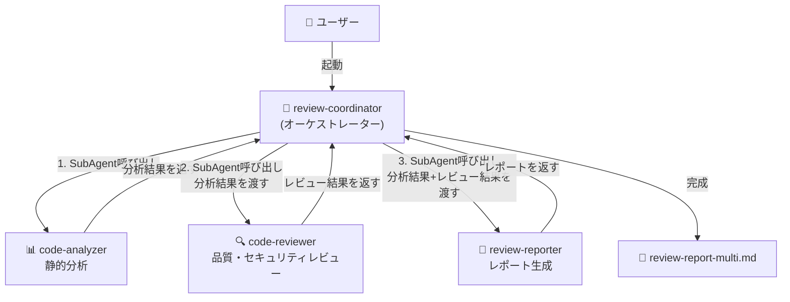

```mermaid
graph TD
    User["👤 ユーザー"] -->|起動| Orchestrator["🎯 review-coordinator<br/>(オーケストレーター)"]

    Orchestrator -->|1. SubAgent呼び出し| Analyzer["📊 code-analyzer<br/>静的分析"]

    Analyzer -->|分析結果を返す| Orchestrator

    Orchestrator -->|2. SubAgent呼び出し<br/>分析結果を渡す| Reviewer["🔍 code-reviewer<br/>品質・セキュリティレビュー"]

    Reviewer -->|レビュー結果を返す| Orchestrator

    Orchestrator -->|3. SubAgent呼び出し<br/>分析結果+レビュー結果を渡す| Reporter["📝 review-reporter<br/>レポート生成"]

    Reporter -->|レポートを返す| Orchestrator

    Orchestrator -->|完成| Output["📄 review-report-multi.md"]
```